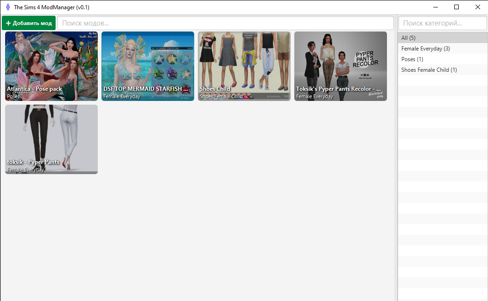

[](https://github.com/CrazyXacker/sims4modmanager/releases)

*S4MM provides to you a wide variety of features:*
* Easy mod (package, zip) installing with several clicks (Work in progress)
* Ability to set mod info: Title, Cover, Description, Link, Category, Related mod link (Work in progress)
* Easy to use library with installed mods
* Search in library
* Filters by category and category search
* Easy and fast one-click mod enabling/disabling
* Easy and fast mod deletion
* Support of mod sites parsing and mod downloading (Work in progress)
* Support of TSR (TheSimsResource) mod downloading (semi-automatic mode)
* Listening Clipboard for supported links (only links)
* Ability to parser and download Required mods. Example: recolor mod from TSR that requires external mesh to work
* etc...



## Downloads

[Download latest Release](https://github.com/CrazyXacker/sims4modmanager/releases)

## Installing

Install **JRE 8 (Java Runtime Environment) or OpenJRE 8 + OpenJFX** if you don't have one of them.  
Then simply download apps **jar** file, put it in some folder and run it by double-click.  

In additional to double-clicking you can run app from **CMD/Terminal** with this command:
```
java -jar <path_to_jar_file>
```

## Adding mods

App is very simple in use:
1. At first start app will ask you to provide path to Sims 4 mods folder. It may be like this: **C:/Users/{user_name}/Electronic Arts/The Sims 4/Mods**. If path is correct, app will let you to proceed. *NOTE: App is using subfolder **Sims4MM** for installed mods. If app can't find this folder - you must provide valid path to Mods folder again.*

2. After folder choosing you may start adding your first mod. There are severals way to do this: add mod from local file (package, zip) **(Work in progress)** or add mod by link from supported sites. *NOTE: as for version 0.1 app is supporting only TSR (TheSimsResource)*

3. Adding from file: **(Work in progress)**

4. Adding by link:  
*a.* App is checking your Clipboard for supported links. If it will be found - you will get request for download.    
*b.* **OR:** Click **+ Add mod** and choose **Add from {site_name}**  
*c.* Insert link to mod page into field and click **OK**. App will download mod with metadata OR open **WebView Package Downloader** where you may need hit **Download** button  
*d.* After downloading, mod with info will appear in app **Library**  
*NOTE: Sometimes, app may request downloading additional mod that is required for normal mod work. You can decline this request but that's not recommended*

**That's all!**

## App usage

After adding/downloading mods you can check their info, enable/disable mod in game or delete it. To do that, simple hover mod card with your mouse and click desired button ;)  
In addition to this features, you may search mods by name or filter them by category in right list.
